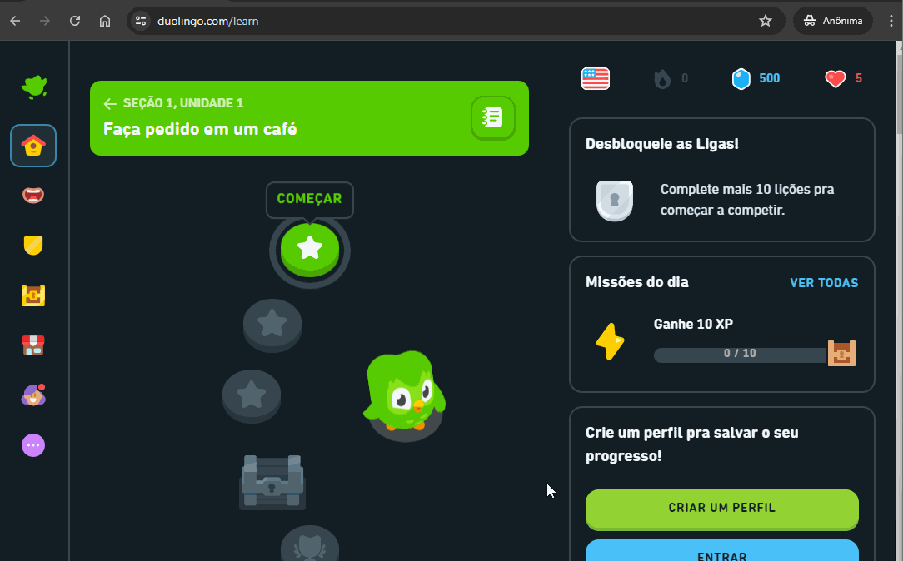
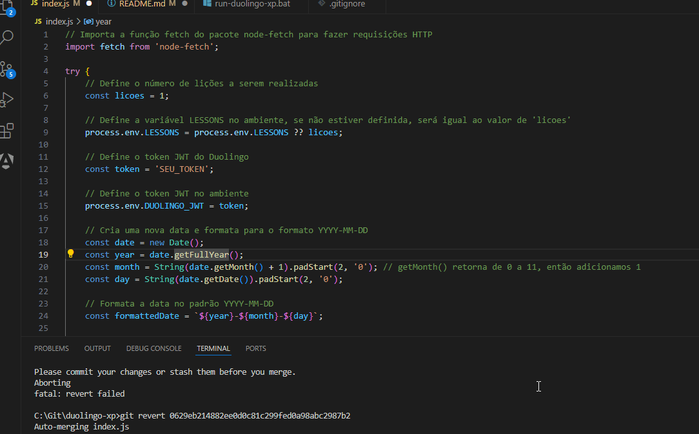
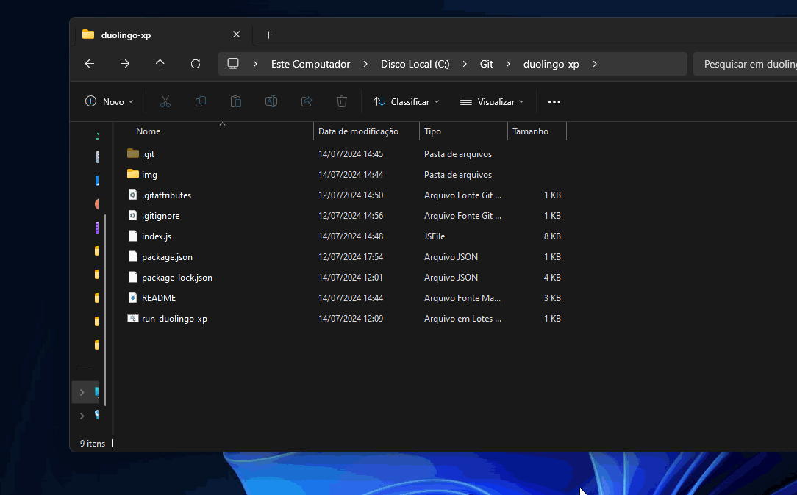

# Duolingo XP Automático


Nunca mais seja rebaixado nas ligas do Duolingo!

-------

## Como Usar

1. **Faça um fork deste repositório:** [Clique aqui para fazer o fork](https://github.com/DevHonorato/duolingo-xp/fork)

2. **Acesse o Duolingo:** [Duolingo](https://www.duolingo.com)

3. **Obtenha o token JWT:**

    - Faça login no [Duolingo](https://www.duolingo.com).

    - Abra o console do navegador:

        - macOS: `Option (⌥) + Command (⌘) + J`

        - Windows/Linux: `Shift + CTRL + J`

        - Digite o codigo abaixo no console do navegador:

        ```js
        document.cookie.split(';').find(cookie => cookie.includes('jwt_token')).split('=')[1]
        ```

        - Copie o valor obtido (sem `'`).

        - 

4. **Configure o token no projeto:**

- Vá para o seu repositório forkado.

- Cole o token no arquivo `index.js` na variável `token`.

- 


-------

## Preparando o Ambiente

Antes de prosseguir, verifique se você tem o `Node.js` e o `npm` instalados. Se você não os tiver, você pode baixá-los nos seguintes links:

- [Node.js](https://nodejs.org/)

O `npm` é instalado automaticamente com o `Node.js`.

Certifique-se de que o Node.js e o npm estão instalados corretamente executando os seguintes comandos:

```
node -v
npm -v
```

Se as versões forem exibidas, a instalação foi bem-sucedida. Em seguida, na raiz do projeto, execute:

```
npm install
```

Isso instalará todas as bibliotecas e pacotes necessários para o projeto.

-------

## Executando 

Agora que você tem todas as dependências instaladas, você pode iniciar o projeto com o seguinte comando:

```
node index.js
```

- Ou use `run-duolingo-xp.bat` para instalar dependências e executar `index.js`.

- 

**Atenção**: Configure as variáveis `token` e `licoes` no `index.js`.

## Observações

- Este projeto não conclui missões diárias ou desafios entre amigos.
- Apenas pratica e ganha XP para avançar em ligas.
- Não afeta seu progresso de aprendizado real no Duolingo.

-------

Gostou deste projeto? 

Considere deixar uma ⭐️ no [GitHub](https://github.com/DevHonorato/duolingo-xp) para nos ajudar!


